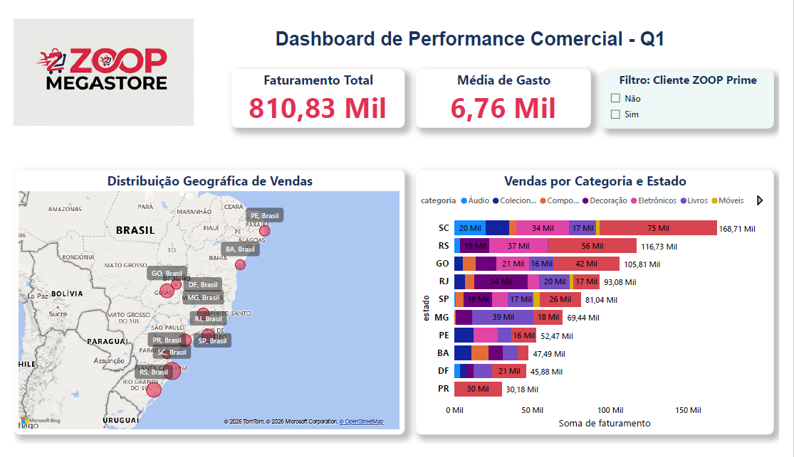
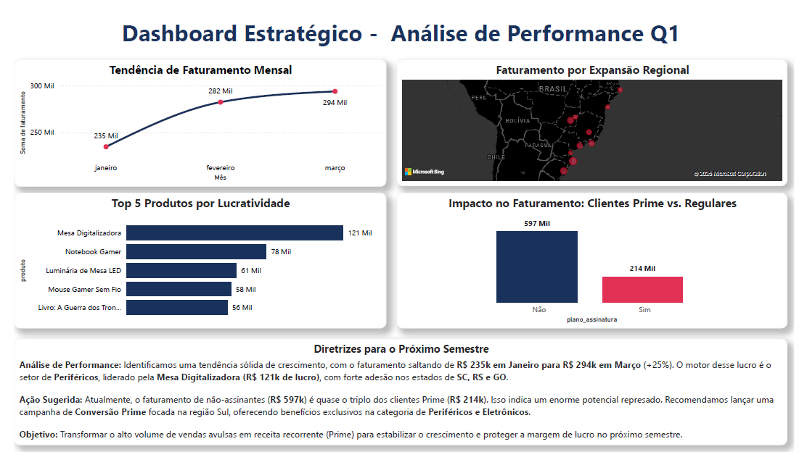

📊 Projeto End-to-End: Dashboard Estratégico ZOOP Megastore

📌 Cenário de Negócio

A ZOOP Megastore precisava entender o perfil de seus clientes e a performance regional para planejar o próximo semestre. O desafio foi integrar dados de diferentes fontes para responder: "Onde investir para maximizar o lucro e converter assinantes?"

🛠️ Tecnologias Utilizadas

Python (Pandas): Limpeza e tratamento de dados brutos.

MySQL: Modelagem e armazenamento do banco de dados relacional.

Power BI: Criação de dashboards interativos e análise estratégica.

🚀 Desafios Superados

Tratamento de Dados: Correção de codificação de caracteres e limpeza de nulos via Python.

Integração: Conexão direta entre MySQL e Power BI para atualização dinâmica.

Storytelling: Transformação de métricas soltas em recomendações executivas focadas em ROI.

📈 Insights Principais:

O faturamento cresceu 25% de Janeiro a Março.

Clientes não-assinantes representam a maior fatia de receita (R$ 597k), revelando uma oportunidade de ouro para conversão.

Os estados de SC, RS e GO são líderes na categoria de Periféricos.

